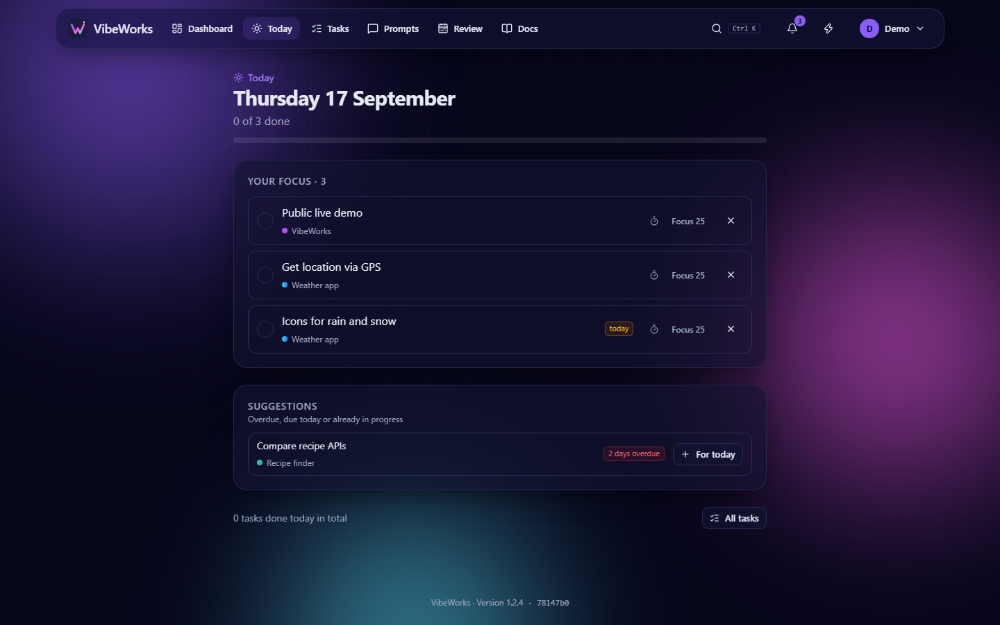
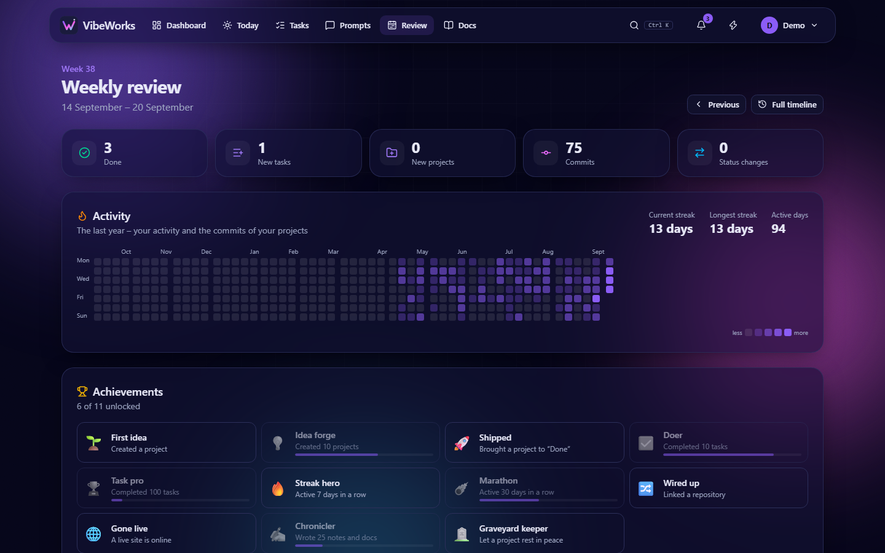
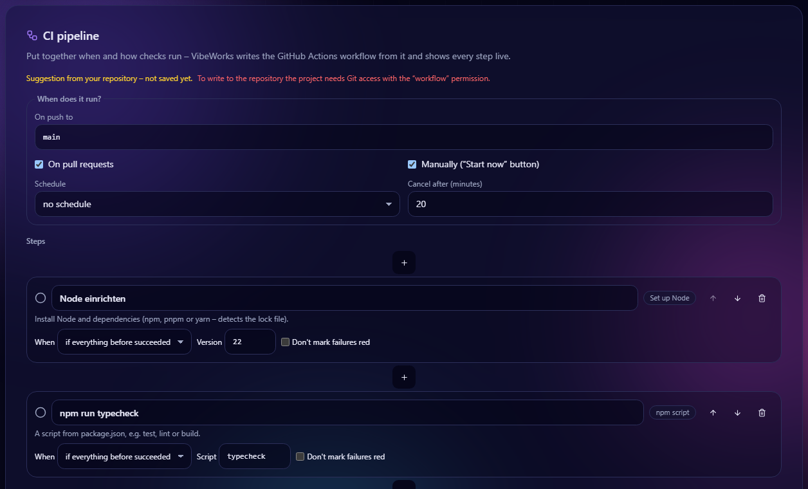
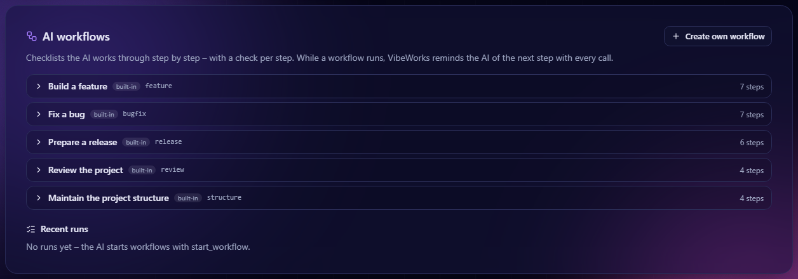
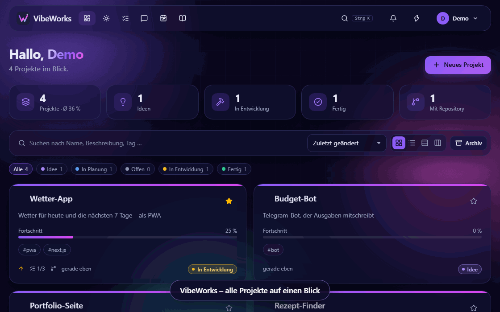
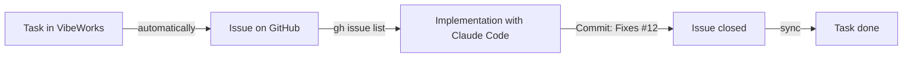

<div align="center">


<p>
  <a href="https://github.com/MoinMornhart/vibeworks/commits/main"></a>
  <a href="https://github.com/MoinMornhart/vibeworks/commits/main"></a>
  
  
  
  <a href="LICENSE"></a>
</p>

<p><a href="README.md">🇩🇪 Deutsch</a> · <b>🇬🇧 English</b></p>

**Projects, tasks, notes, commits and your AI in one place – on your own server.**

🌐 **[Website & docs](https://moinmornhart.github.io/vibeworks/en/)**

[Features](#-features) · [Screenshots](#-screenshots) · [Installation](#-installation-on-proxmox) · [Tasks ↔ issues](#-tasks--issues--claude-code) · [Connect AI (MCP)](#-connect-ai-mcp) · [Discord](#-discord) · [Windows app](#-windows-app) · [Development](#%EF%B8%8F-development)

<br>


</div>

<br>

Vibe coding quickly leaves you with lots of half-finished projects: a repo here, an idea there,
a note somewhere else. **VibeWorks** gathers everything in one place – ideas, status, tasks,
notes, documentation and the commits from your repositories. Claude Code and other AIs work
along via MCP – with rules, workflows and verification steps. It runs on your own Proxmox
server, updates itself and looks exactly the way **you** want – in English or German, set per
account.

## ✨ Features

<table>
  <tr>
    <td width="50%" valign="top">
      <h3>🗂️ Projects</h3>
      Grid, list, status groups or a drag-and-drop kanban board. Status from <em>Idea</em> to
      <em>Done</em>, priority, progress, tags, favorites and bulk editing.
    </td>
    <td width="50%" valign="top">
      <h3>✅ Tasks</h3>
      A board per project and an overview across all projects – with due dates, recurrence and
      labels. Done and blocked tasks fade out after two days; custom columns and one-click
      clean-up included.
    </td>
  </tr>
  <tr>
    <td valign="top">
      <h3>🔀 Git &amp; updates</h3>
      Commits from GitHub, GitLab, Gitea or any Git server as a timeline, CI status at a glance.
      Tasks automatically become issues – and sync back; instantly via webhook, optionally through
      your own bot.
    </td>
    <td valign="top">
      <h3>📝 Notes &amp; docs</h3>
      Markdown notes right on the project, plus mini docs with a page tree for everything you
      keep looking up.
    </td>
  </tr>
  <tr>
    <td valign="top">
      <h3>🎨 Your design</h3>
      Animated backgrounds (nebula, starfield, aurora, particles, waves, synthwave …), your own
      gradient or image, accent color, full palette, light/dark mode and glass effect – for every
      account individually.
    </td>
    <td valign="top">
      <h3>🔐 Secure</h3>
      Passkeys, two-factor sign-in with recovery codes, session management, lockout after failed
      attempts, CSP, CSRF and SSRF protection, encrypted tokens.
    </td>
  </tr>
  <tr>
    <td valign="top">
      <h3>🤖 AI hub</h3>
      MCP server with more than 40 tools, device-code sign-in, project keys with expiry, AI
      workflows with verification steps, a project structure table and rules as CLAUDE.md,
      AGENTS.md, GEMINI.md, Copilot, Cursor, Windsurf or Cline file.
    </td>
    <td valign="top">
      <h3>🧪 Checks &amp; CI</h3>
      CI designer with a live view per step, repo check without AI (secrets, vulnerabilities,
      dead code), Lighthouse check of the live site, dependencies for npm, PyPI, Cargo, Go,
      Composer and Maven, code graph and merge conflicts in the browser.
    </td>
  </tr>
  <tr>
    <td valign="top">
      <h3>👥 Together</h3>
      Project sharing, teams, roles with individual permissions, community with chat, Discord
      bot with short reports, invite links.
    </td>
    <td valign="top">
      <h3>🧭 Overview</h3>
      Today list, weekly review with heatmap and achievements, weekly report, suggestions for the
      week, live monitoring, costs, error inbox and a graveyard for projects that fell asleep.
    </td>
  </tr>
  <tr>
    <td valign="top">
      <h3>⚡ Fast</h3>
      Command palette with <kbd>Ctrl</kbd>+<kbd>K</kbd>, full-text search across projects, notes,
      tasks and docs, quick capture with the lightning button – on your phone, too.
    </td>
    <td valign="top">
      <h3>🚀 Low maintenance</h3>
      One command installs everything on Proxmox. Updates arrive on their own every 15 minutes,
      with backup, health check and automatic rollback.
    </td>
  </tr>
</table>

## 📸 Screenshots

<table>
  <tr>
    <td width="50%"><p align="center"><sub>Project page</sub></p></td>
    <td width="50%"><p align="center"><sub>Git &amp; updates</sub></p></td>
  </tr>
  <tr>
    <td><p align="center"><sub>Today</sub></p></td>
    <td><p align="center"><sub>Weekly review</sub></p></td>
  </tr>
  <tr>
    <td><p align="center"><sub>Your own design</sub></p></td>
    <td><p align="center"><sub>Mini docs</sub></p></td>
  </tr>
  <tr>
    <td><p align="center"><sub>CI designer</sub></p></td>
    <td><p align="center"><sub>AI workflows</sub></p></td>
  </tr>
</table>

<p align="center">
  
  <br><sub>Task board – with a Git connection these become issues automatically</sub>
</p>

<p align="center">
  
  <br><sub>On the go, too</sub>
</p>

## 🚀 Installation on Proxmox

Run on the Proxmox VE host:

```bash
bash -c "$(curl -fsSL https://raw.githubusercontent.com/MoinMornhart/vibeworks/main/install/proxmox.sh)"
```

The script creates a Debian LXC container, installs Node.js, PostgreSQL and VibeWorks and sets up
automatic updates. Details are in [docs/INSTALLATION.en.md](docs/INSTALLATION.en.md).

### Commands

On the **Proxmox host** (set up by the installer):

```bash
vibeworks status                         # version, releases, auto-update, service
vibeworks update                         # install the latest version
vibeworks domain vibeworks.example.com   # change the address
vibeworks repair                         # repair the installation inside the container
vibeworks help                           # all commands
```

The host also gets the shortcut **`update`** (= `vibeworks update`, also `update --status` etc.).
Adding the commands to an existing host – installs them and immediately fetches the latest update
(an incomplete installation gets repaired along the way):

```bash
curl -fsSL https://raw.githubusercontent.com/MoinMornhart/vibeworks/main/install/vibeworks-host.sh -o /usr/local/bin/vibeworks && chmod +x /usr/local/bin/vibeworks && ln -sf /usr/local/bin/vibeworks /usr/local/bin/update && update
```

Inside the **container** the command is `update` (`update --status`, `update --rollback`,
`update --domain …`, `update --help`). The admin area also has an "Install latest update" button.

On top of that, the server checks for new versions **every 15 minutes** by itself. Every version
is built in its own directory; it only switches over once the build succeeds and the app answers
healthy afterwards – otherwise everything stays on, or automatically rolls back to, the last
working version.

## 🔀 Tasks ↔ issues & Claude Code

<p align="center">
  
  <br><sub>Task → issue → Claude → done (demo in German)</sub>
</p>

**Repositories connect themselves:** with a Git connection (GitHub, GitLab, Gitea/Forgejo), VibeWorks
creates a project for every repository you own – right when connecting and every 30 minutes for new
ones. Forks and archived ones stay out, deleted projects don't come back. **Any other Git server**
works too: a “plain Git server” connection with access as `user:token` – commits and dependencies are
then fetched directly with git; there are no issues or CI there. **Errors** (token expired, repository
gone …) show up at the connection, on the project card and on the dashboard; if a sync fails three
times in a row, you get a notification.

Add a repository to a project and VibeWorks shows its commits below the notes. With a Git
connection (**My account → Git connections** – GitHub, GitLab or Gitea/Forgejo, self-hosted
too) every task also becomes an issue automatically. The connection applies to all your projects
on that server, and the server syncs by itself every 5 minutes – with a webhook (project page →
**Git & updates** → **Access**) even instantly. The status travels both ways:

| Column in VibeWorks | Issue in the repository |
| --- | --- |
| Open | open |
| In progress | open, label `in Arbeit` |
| Blocked | open, label `blockiert` |
| Done | closed |

The two status labels keep their German names (`in Arbeit` = in progress, `blockiert` = blocked)
so that German and English accounts can share the same repository.

This makes it easy to let an AI work through your tasks – for example with
[Claude Code](https://claude.com/claude-code): "Work through the open issues." Claude fetches the
issues with `gh issue list`, sets `in Arbeit`, commits with `Fixes #12` – the issue closes, and on
the next sync the task in VibeWorks jumps to *Done*.



<details>
<summary><b>Which token do I need?</b></summary>

When you connect, the app shows a short guide with a link to the right token page:

| Provider | Token |
| --- | --- |
| GitHub | Classic token with the `repo`, `admin:repo_hook` (webhooks) and `workflow` (repo check) scopes; the link is pre-filled |
| GitLab | Personal access token with the `api` scope |
| Gitea / Forgejo | Token with *repository: read* and *issue: read and write* |

You can add the connection right when you sign up, or later under "My account". A separate
token per project still works (project page → **Git & updates** → **Access**). For public
repositories without issue mirroring the address is enough – no token needed at all. Tokens are
verified when saved, stored encrypted with AES-256-GCM and never shown in full again.

</details>

## 🤖 Connect AI (MCP)

VibeWorks is also an MCP server. Three ways to connect:

- **One-liner:** Create a key under **My account → Claude Code & API keys** – the app shows a command
  for Linux/macOS and Windows that adds VibeWorks to Claude Code and saves the agent rules as a
  skill. By hand it looks like this:
  ```bash
  claude mcp add --scope user --transport http vibeworks https://vibeworks.example.com/api/mcp --header "Authorization: Bearer vw_…"
  ```
- **Device code:** AI programs that support device sign-in show a code – enter it at `/verbinden`,
  confirm, done. No key to copy.
- **Project keys:** Keys for selected projects only, with an expiry date and a pause button – handy
  for third-party agents or collaborators. Team members with the right permission grant them
  directly on the project.

After that, the AI works directly with your projects – no GitHub detour needed:

| Tool | What it does |
| --- | --- |
| `list_projects`, `get_project` | Projects with status, open tasks, notes and repository |
| `list_tasks`, `get_task` | Tasks across all projects – e.g. everything due this week |
| `create_task`, `update_task` | Create tasks and move them to *In progress* or *Done* – mirrored issues follow |
| `list_task_comments`, `add_task_comment` | Read the conversation under an issue and reply |
| `create_task_in_projects` | The same task in several projects – by default in all linked to Git |
| `get_claude_md`, `get_agent_file`, `list_prompts`, `get_prompt` | Instructions for the AI (CLAUDE.md, AGENTS.md, Cursor …) and your prompt library |
| `update_project`, `review_projects` | Status, priority, progress, summary – and an overview of what's missing |
| `get_project_structure`, `update_project_structure` | A table of how the project is built |
| `list_workflows`, `start_workflow`, `complete_workflow_step`, `save_workflow` | Work through AI workflows step by step with verification |
| `get_ci`, `save_ci`, `run_ci` | Read, change and start the CI pipeline |
| `list_code_files`, `search_code`, `get_code_graph`, `add_code_memo` | Search code, see connections, leave notes on code |
| `create_note`, `get_note` | Notes on a project, e.g. a work log |
| `search` | Full-text search across notes, tasks and docs |
| `list_docs`, `get_doc`, `create_doc`, `update_doc` | Read and write your docs |
| `get_repo_status`, `list_problems` | A repository's state (commits, CI, dependencies, repo check, live site) and everything that needs attention |
| `list_errors`, `resolve_error` | Read errors from the error inbox with stack traces and tick them off after fixing |
| `get_today`, `add_to_today`, `remove_from_today` | Plan the day – picked tasks and suggestions |
| `start_timer`, `stop_timer` | Track time on a task, also as a focus timer |

Your **prompt library** also shows up in Claude Code as commands (`/mcp__vibeworks__…`, optionally filled in
with a project), and **every project's CLAUDE.md**, "problems" and "today" can be attached as resources
(`@vibeworks:…`).

The built-in workflows (feature, bug fix, release …) are available as commands as well.

Try for example: "Which tasks are open in VibeWorks?" or "Work through the open tasks of project X
and write down what you did as a note." Claude acts with your permissions, and every change shows
up in the project's activity log. Only a hash of each key is stored; you can revoke keys at any time.
Other MCP clients connect to `/api/mcp` via Streamable HTTP with the same header.

## 💬 Discord

Under **My account → Discord**, invite the VibeWorks bot to your server with one click (an admin sets
up Discord once under *Administration*). The bot forwards your notifications to a channel, sends a
short report every morning or on Mondays if you like, and answers `/vibeworks status`, `tasks`,
`problems` and `here`.

## 🪟 Windows app

**[⬇️ Download VibeWorks-Setup.exe](https://github.com/MoinMornhart/vibeworks/releases/download/desktop-latest/VibeWorks-Setup.exe)** –
run it, enter your server's address, sign in. The app updates itself afterwards.

- **Its own window** instead of a browser tab, with a Start menu entry
- **Tray next to the clock** – closing keeps the app running in the background (can be turned off)
- **Quick capture with <kbd>Ctrl</kbd>+<kbd>Alt</kbd>+<kbd>V</kbd>** – jot down an idea or task from any program
- **Windows notifications** for due tasks, red CI, access requests and everything else from *My account → Notifications*

The installer is not signed (yet): on first launch Windows says "Windows protected your PC" – click
**More info → Run anyway**. The code lives in [`desktop/`](desktop/); GitHub Actions builds the
installer for every new app version.

## 🛠️ Development

```bash
npm install
npm run setup          # create .env with a random APP_SECRET
npm run db:migrate     # apply the schema to the PostgreSQL from DATABASE_URL
npm run dev            # → http://localhost:3000
```

| Script | Purpose |
| --- | --- |
| `npm run dev` | Development server |
| `npm run build` / `npm start` | Production build and start |
| `npm run typecheck` | Type-check with TypeScript |
| `npm test` | Unit tests (Vitest) |
| `npm run check:code` | Dead code and cycles (fallow) |
| `npm run version:bump` | Bump the version by one step |

**Stack:** Next.js 16 (App Router) · React 19 · TypeScript · Tailwind CSS 4 · Prisma 7 ·
PostgreSQL · SimpleWebAuthn · dnd-kit · Vitest · fallow

Every push runs through the GitHub Actions CI (types, tests, fallow, build).

Translations live in `src/lib/i18n/messages/` – one file per area with a German and an English
version; TypeScript makes sure both have exactly the same keys.

### Version scheme

Versions count like an odometer with a carry at 9:
`0.0.1 → 0.0.2 → … → 0.0.9 → 0.1.0 → … → 0.9.9 → 1.0.0`.
The version shown in the app comes from `package.json`; the number of commits is only the
update number. Every shipped change gets an entry in the changelog (`src/lib/changelog.ts`), which is shown in the app.

## 🗺️ Roadmap

✅ = done · ⏳ = coming up

**Stage 1 – Foundations** ✅

- ✅ Sign-in with password, passkeys and two-factor, multi-user mode
- ✅ Projects, notes, tasks and mini docs
- ✅ Personal design for every account
- ✅ User interface in English and German
- ✅ Proxmox installer, `update` command and auto-update

**Stage 2 – Git integration**

- ✅ Commits on the project page
- ✅ Tasks ↔ issues (GitHub, GitLab, Gitea/Forgejo)
- ✅ Account-wide Git connections, background sync
- ✅ Project sharing
- ✅ CI status (GitHub Actions, GitLab pipelines, Gitea)
- ✅ Webhooks – changes arrive instantly

**Stage 3 – Overview & comfort**

- ✅ Weekly review and timeline
- ✅ Project templates (built-in and your own)
- ✅ Import/export as JSON
- ✅ Notifications (ntfy, webhook, email)

**Stage 4 – AI, monitoring & fun**

- ✅ VibeWorks as an MCP server for Claude Code – tasks, notes and docs right from Claude
- ✅ Windows app with tray, quick capture via shortcut, Windows notifications and auto-update
- ✅ Automatic progress by analyzing tasks, commits, CI and planning – with "How is it calculated?"
- ✅ One task for several projects at once, e.g. all linked to Git
- ✅ Live monitoring: availability, response time, SSL expiry and uptime bar
- ✅ Project graveyard: a nudge after 30 quiet days, a tombstone with lifespan – and resurrection
- ✅ Activity heatmap across all projects, streaks and small achievements
- ✅ Costs per project (hosting, domain, AI APIs) with a warning before a domain expires
- ✅ Prompt library and a CLAUDE.md generator from description, notes and tasks
- ✅ Idea inbox via "share" from your phone (PWA), a drop address (also for mail forwarding) or ntfy
- ✅ Time tracking and focus timer per task, evaluated in the weekly review
- ✅ Today view: plan tasks from all projects for the day and check them off
- ✅ Dependency check: outdated packages and security alerts from the repository
- ✅ Whatever the dependency check flags lands on the board as a task right away – and closes itself
- ✅ Repo check without AI (GitHub Actions): secrets, vulnerabilities, bug patterns and TODOs
- ✅ Error inbox: apps report runtime errors via snippet (browser, Node.js, curl), grouped, with notifications
- ✅ Invitation links for new accounts: single use, with an expiry date, even when registration is closed
- ✅ Community for the accounts of the instance: present projects, questions, ideas and bug reports, chat (lobby and per project), moderation, reporting and bans
- ✅ Presentation slides per project: built from description, status, commits and next steps, with fullscreen and keyboard
- ✅ Teams: share projects with whole teams, joining by invitation only
- ✅ Roles with individual permissions for members and teams – built-in roles, admin templates and your own
- ✅ Public portfolio with selected projects

**Stage 5 – AI work & automation**

- ✅ One-liner install, device sign-in and project keys for AI programs
- ✅ AI workflows with verification steps and a project structure table – for whole teams, too
- ✅ Structure watcher: flags when the structure table no longer matches the repository
- ✅ Weekly report on Mondays via ntfy, webhook, email or Discord
- ✅ Lighthouse check of the live site (performance, accessibility, SEO, broken links) as a switch
- ✅ Instructions for Claude, Codex, Gemini, Copilot, Cursor, Windsurf and Cline
- ✅ GitHub issues become tasks, bot in one click, commands in issue comments
- ✅ CI designer with live view
- ✅ Dependencies for npm, PyPI, Cargo, Go, Composer and Maven, branch selectable
- ✅ Code graph, code search and merge conflicts in the browser
- ✅ Discord bot with commands, notifications and reports
- ✅ Getting started checklist on the dashboard

**Website**

- ✅ Landing page on GitHub Pages with a copyable install command – [moinmornhart.github.io/vibeworks](https://moinmornhart.github.io/vibeworks/en/)
- ✅ Demo mode with a read-only demo account, sample data and a nightly reset ([demo instance](docs/INSTALLATION.en.md#demo-instance))
- ⏳ Public live demo
- ✅ Docs pages in English and German
- ✅ Short demo GIF: task → issue → Claude → done

## 📄 License

MIT – see [LICENSE](LICENSE).
