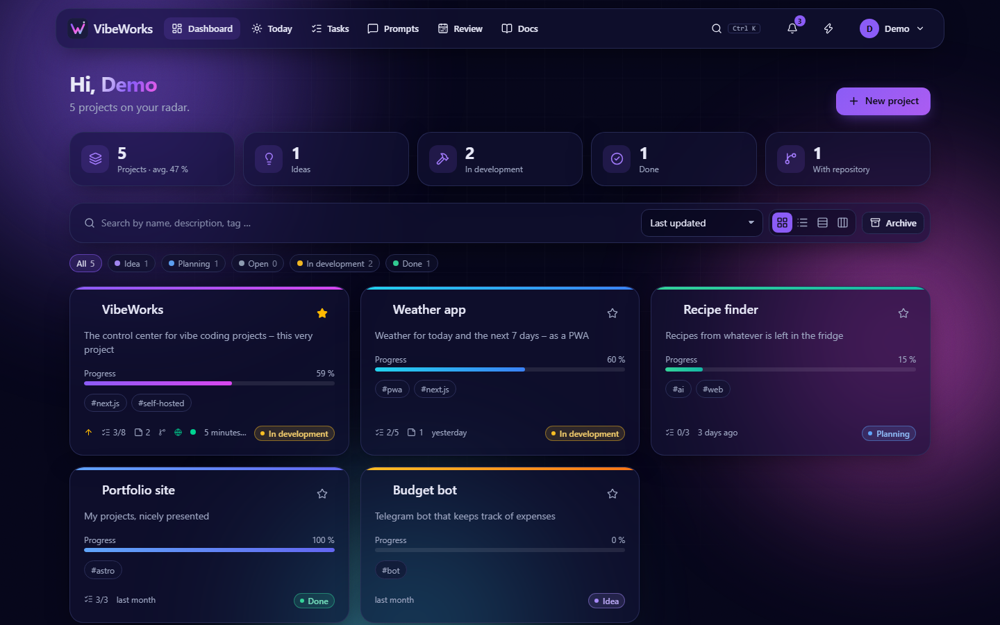
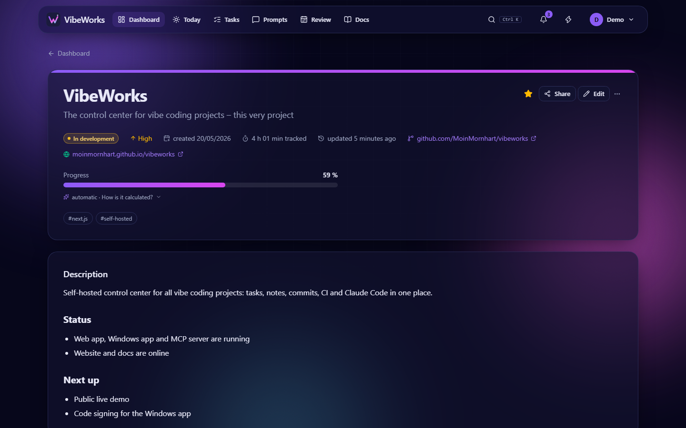
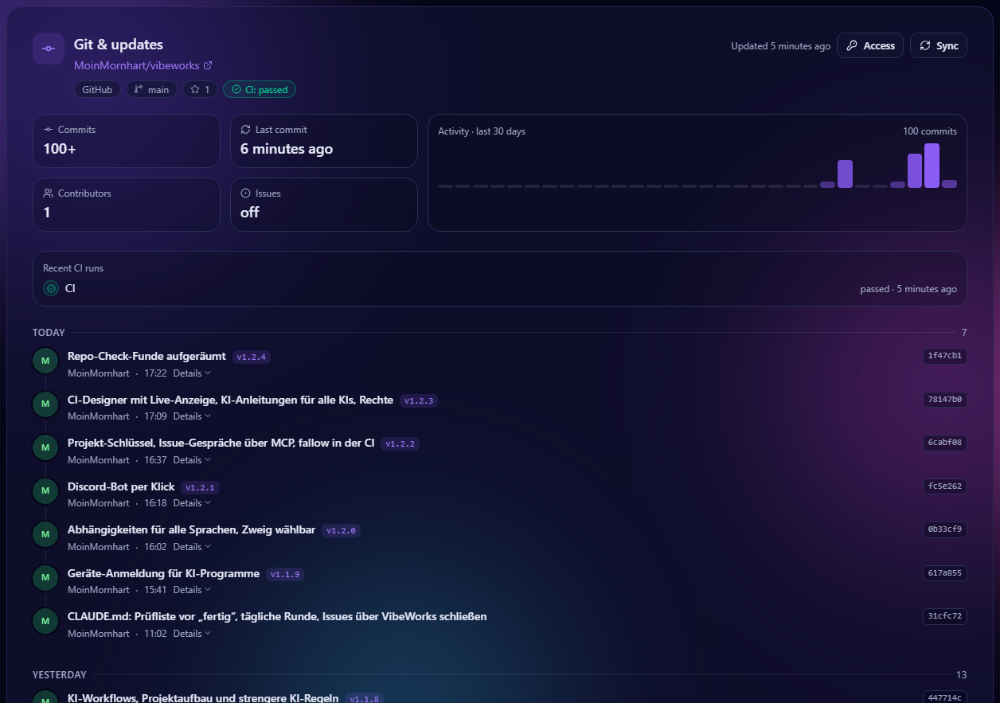
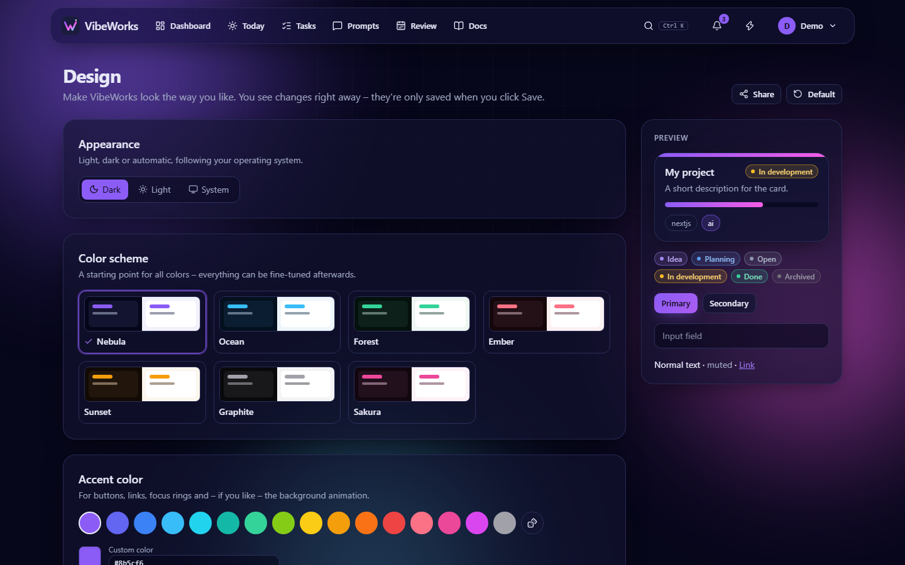
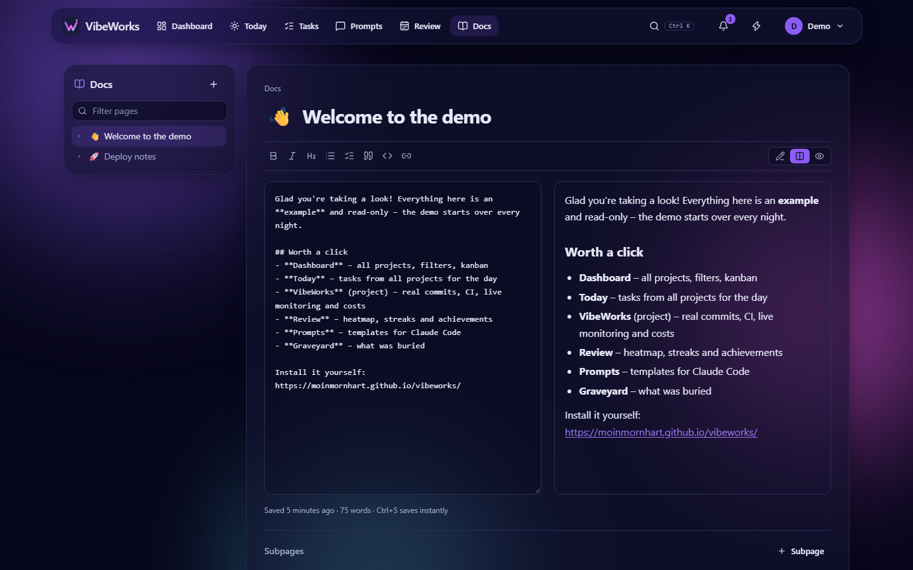
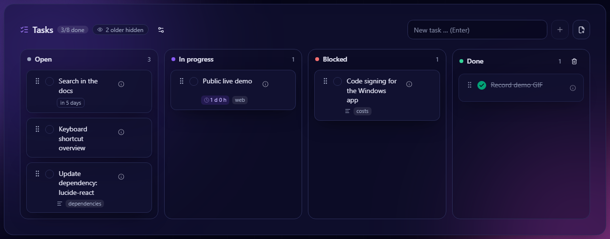
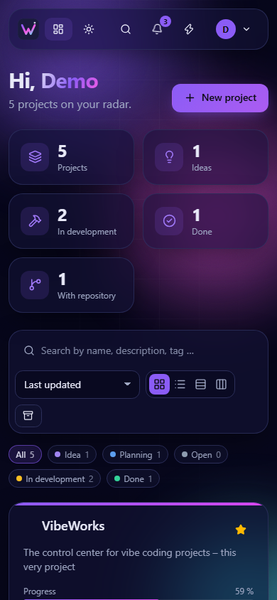
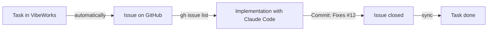

<div align="center">



<p>
  <a href="https://github.com/MoinMornhart/vibeworks/commits/main"></a>
  <a href="https://github.com/MoinMornhart/vibeworks/commits/main"></a>
  
  
  
  <a href="LICENSE"></a>
</p>

<p><a href="README.md">🇩🇪 Deutsch</a> · <b>🇬🇧 English</b></p>

**Projects, tasks, notes and commits in one place – on your own server.**

[Features](#-features) · [Screenshots](#-screenshots) · [Installation](#-installation-on-proxmox) · [Tasks ↔ issues](#-tasks--issues--claude-code) · [Claude Code (MCP)](#-claude-code-mcp) · [Windows app](#-windows-app) · [Development](#%EF%B8%8F-development)

<br>



</div>

<br>

Vibe coding quickly leaves you with lots of half-finished projects: a repo here, an idea there,
a note somewhere else. **VibeWorks** gathers everything in one place – ideas, status, tasks,
notes, documentation and the commits from your repositories. It runs on your own Proxmox
server, updates itself and looks exactly the way **you** want – in English or German, set per
account.

## ✨ Features

<table>
  <tr>
    <td width="50%" valign="top">
      <h3>🗂️ Projects</h3>
      Grid, list, status groups or a drag-and-drop kanban board. Status from <em>Idea</em> to
      <em>Done</em>, priority, progress, tags, favorites and bulk editing.
    </td>
    <td width="50%" valign="top">
      <h3>✅ Tasks</h3>
      A board per project and an overview across all projects – with due dates, recurrence and
      labels. Done and blocked tasks tidy themselves away after two days.
    </td>
  </tr>
  <tr>
    <td valign="top">
      <h3>🔀 Git &amp; updates</h3>
      Commits from GitHub, GitLab or Gitea as a timeline with an activity chart, CI status at a
      glance. Tasks can automatically become issues – and sync back; instantly via webhook.
    </td>
    <td valign="top">
      <h3>📝 Notes &amp; docs</h3>
      Markdown notes right on the project, plus mini docs with a page tree for everything you
      keep looking up.
    </td>
  </tr>
  <tr>
    <td valign="top">
      <h3>🎨 Your design</h3>
      Animated backgrounds (nebula, starfield, aurora, particles, waves, synthwave …), your own
      gradient or image, accent color, full palette, light/dark mode and glass effect – for every
      account individually.
    </td>
    <td valign="top">
      <h3>🔐 Secure</h3>
      Passkeys, two-factor sign-in with recovery codes, session management, lockout after failed
      attempts, CSP, CSRF and SSRF protection, encrypted tokens.
    </td>
  </tr>
  <tr>
    <td valign="top">
      <h3>⚡ Fast</h3>
      Command palette with <kbd>Ctrl</kbd>+<kbd>K</kbd>, full-text search across projects, notes,
      tasks and docs, quick capture with the lightning button – on your phone, too.
    </td>
    <td valign="top">
      <h3>🚀 Low maintenance</h3>
      One command installs everything on Proxmox. Updates arrive on their own every 15 minutes,
      with backup, health check and automatic rollback.
    </td>
  </tr>
</table>

## 📸 Screenshots

<table>
  <tr>
    <td width="50%"><p align="center"><sub>Project page</sub></p></td>
    <td width="50%"><p align="center"><sub>Git &amp; updates</sub></p></td>
  </tr>
  <tr>
    <td><p align="center"><sub>Your own design</sub></p></td>
    <td><p align="center"><sub>Mini docs</sub></p></td>
  </tr>
</table>

<p align="center">
  
  <br><sub>Task board – with a Git connection these become issues automatically</sub>
</p>

<p align="center">
  
  <br><sub>On the go, too</sub>
</p>

## 🚀 Installation on Proxmox

Run on the Proxmox VE host:

```bash
bash -c "$(curl -fsSL https://raw.githubusercontent.com/MoinMornhart/vibeworks/main/install/proxmox.sh)"
```

The script creates a Debian LXC container, installs Node.js, PostgreSQL and VibeWorks and sets up
automatic updates. Details are in [docs/INSTALLATION.en.md](docs/INSTALLATION.en.md).

### Commands

On the **Proxmox host** (set up by the installer):

```bash
vibeworks status                         # version, releases, auto-update, service
vibeworks update                         # install the latest version
vibeworks domain vibeworks.example.com   # change the address
vibeworks repair                         # repair the installation inside the container
vibeworks help                           # all commands
```

The host also gets the shortcut **`update`** (= `vibeworks update`, also `update --status` etc.).
Adding the commands to an existing host – installs them and immediately fetches the latest update
(an incomplete installation gets repaired along the way):

```bash
curl -fsSL https://raw.githubusercontent.com/MoinMornhart/vibeworks/main/install/vibeworks-host.sh -o /usr/local/bin/vibeworks && chmod +x /usr/local/bin/vibeworks && ln -sf /usr/local/bin/vibeworks /usr/local/bin/update && update
```

Inside the **container** the command is `update` (`update --status`, `update --rollback`,
`update --domain …`, `update --help`). The admin area also has an "Install latest update" button.

On top of that, the server checks for new versions **every 15 minutes** by itself. Every version
is built in its own directory; it only switches over once the build succeeds and the app answers
healthy afterwards – otherwise everything stays on, or automatically rolls back to, the last
working version.

## 🔀 Tasks ↔ issues & Claude Code

Add a repository to a project and VibeWorks shows its commits below the notes. With a Git
connection (**My account → Git connections** – GitHub, GitLab or Gitea/Forgejo, self-hosted
too) every task also becomes an issue automatically. The connection applies to all your projects
on that server, and the server syncs by itself every 5 minutes – with a webhook (project page →
**Git & updates** → **Access**) even instantly. The status travels both ways:

| Column in VibeWorks | Issue in the repository |
| --- | --- |
| Open | open |
| In progress | open, label `in Arbeit` |
| Blocked | open, label `blockiert` |
| Done | closed |

The two status labels keep their German names (`in Arbeit` = in progress, `blockiert` = blocked)
so that German and English accounts can share the same repository.

This makes it easy to let an AI work through your tasks – for example with
[Claude Code](https://claude.com/claude-code): "Work through the open issues." Claude fetches the
issues with `gh issue list`, sets `in Arbeit`, commits with `Fixes #12` – the issue closes, and on
the next sync the task in VibeWorks jumps to *Done*.



<details>
<summary><b>Which token do I need?</b></summary>

When you connect, the app shows a short guide with a link to the right token page:

| Provider | Token |
| --- | --- |
| GitHub | Classic token with the `repo` and `admin:repo_hook` scopes (for webhooks; the link is pre-filled) |
| GitLab | Personal access token with the `api` scope |
| Gitea / Forgejo | Token with *repository: read* and *issue: read and write* |

You can add the connection right when you sign up, or later under "My account". A separate
token per project still works (project page → **Git & updates** → **Access**). For public
repositories without issue mirroring the address is enough – no token needed at all. Tokens are
verified when saved, stored encrypted with AES-256-GCM and never shown in full again.

</details>

## 🤖 Claude Code (MCP)

VibeWorks is also an MCP server. Create an API key under **My account → Claude Code & API keys** –
the app shows the finished command right away:

```bash
claude mcp add --scope user --transport http vibeworks https://vibeworks.example.com/api/mcp --header "Authorization: Bearer vw_…"
```

After that, Claude Code works directly with your projects – no GitHub detour needed:

| Tool | What it does |
| --- | --- |
| `list_projects`, `get_project` | Projects with status, open tasks, notes and repository |
| `list_tasks`, `get_task` | Tasks across all projects – e.g. everything due this week |
| `create_task`, `update_task` | Create tasks and move them to *In progress* or *Done* – mirrored issues follow |
| `create_task_in_projects` | The same task in several projects – by default in all linked to Git |
| `get_claude_md`, `list_prompts`, `get_prompt` | A ready-made CLAUDE.md for a project and your prompt library |
| `update_project` | Status, priority, progress and summary |
| `create_note`, `get_note` | Notes on a project, e.g. a work log |
| `search` | Full-text search across notes, tasks and docs |
| `list_docs`, `get_doc`, `create_doc`, `update_doc` | Read and write your docs |

Try for example: "Which tasks are open in VibeWorks?" or "Work through the open tasks of project X
and write down what you did as a note." Claude acts with your permissions, and every change shows
up in the project's activity log. Only a hash of each key is stored; you can revoke keys at any time.
Other MCP clients connect to `/api/mcp` via Streamable HTTP with the same header.

## 🪟 Windows app

**[⬇️ Download VibeWorks-Setup.exe](https://github.com/MoinMornhart/vibeworks/releases/download/desktop-latest/VibeWorks-Setup.exe)** –
run it, enter your server's address, sign in. The app updates itself afterwards.

- **Its own window** instead of a browser tab, with a Start menu entry
- **Tray next to the clock** – closing keeps the app running in the background (can be turned off)
- **Quick capture with <kbd>Ctrl</kbd>+<kbd>Alt</kbd>+<kbd>V</kbd>** – jot down an idea or task from any program
- **Windows notifications** for due tasks, red CI, access requests and everything else from *My account → Notifications*

The installer is not signed (yet): on first launch Windows says "Windows protected your PC" – click
**More info → Run anyway**. The code lives in [`desktop/`](desktop/); GitHub Actions builds the
installer for every new app version.

## 🛠️ Development

```bash
npm install
npm run setup          # create .env with a random APP_SECRET
npm run db:migrate     # apply the schema to the PostgreSQL from DATABASE_URL
npm run dev            # → http://localhost:3000
```

| Script | Purpose |
| --- | --- |
| `npm run dev` | Development server |
| `npm run build` / `npm start` | Production build and start |
| `npm run typecheck` | Type-check with TypeScript |
| `npm test` | Unit tests (Vitest) |
| `npm run version:bump` | Bump the version by one step |

**Stack:** Next.js 15 (App Router) · React 19 · TypeScript · Tailwind CSS 4 · Prisma ·
PostgreSQL · SimpleWebAuthn · dnd-kit · Vitest

Translations live in `src/lib/i18n/messages/` – one file per area with a German and an English
version; TypeScript makes sure both have exactly the same keys.

### Version scheme

Versions count like an odometer with a carry at 9:
`0.0.1 → 0.0.2 → … → 0.0.9 → 0.1.0 → … → 0.9.9 → 1.0.0`.
The running app derives its version from the number of commits; every shipped change gets an
entry in the changelog (`src/lib/changelog.ts`), which is shown in the app.

## 🗺️ Roadmap

✅ = done · ⏳ = coming up

**Stage 1 – Foundations** ✅

- ✅ Sign-in with password, passkeys and two-factor, multi-user mode
- ✅ Projects, notes, tasks and mini docs
- ✅ Personal design for every account
- ✅ User interface in English and German
- ✅ Proxmox installer, `update` command and auto-update

**Stage 2 – Git integration**

- ✅ Commits on the project page
- ✅ Tasks ↔ issues (GitHub, GitLab, Gitea/Forgejo)
- ✅ Account-wide Git connections, background sync
- ✅ Project sharing
- ✅ CI status (GitHub Actions, GitLab pipelines, Gitea)
- ✅ Webhooks – changes arrive instantly

**Stage 3 – Overview & comfort**

- ✅ Weekly review and timeline
- ✅ Project templates (built-in and your own)
- ✅ Import/export as JSON
- ✅ Notifications (ntfy, webhook, email)

**Stage 4 – AI, monitoring & fun**

- ✅ VibeWorks as an MCP server for Claude Code – tasks, notes and docs right from Claude
- ✅ Windows app with tray, quick capture via shortcut, Windows notifications and auto-update
- ✅ Automatic progress by analyzing tasks, commits, CI and planning – with "How is it calculated?"
- ✅ One task for several projects at once, e.g. all linked to Git
- ✅ Live monitoring: availability, response time, SSL expiry and uptime bar
- ✅ Project graveyard: a nudge after 30 quiet days, a tombstone with lifespan – and resurrection
- ✅ Activity heatmap across all projects, streaks and small achievements
- ✅ Costs per project (hosting, domain, AI APIs) with a warning before a domain expires
- ✅ Prompt library and a CLAUDE.md generator from description, notes and tasks
- ⏳ Idea inbox via ntfy, email or "share" from your phone (PWA)
- ✅ Time tracking and focus timer per task, evaluated in the weekly review
- ✅ Today view: plan tasks from all projects for the day and check them off
- ✅ Dependency check: outdated packages and security alerts from the repository
- ⏳ Public portfolio with selected projects

**Website**

- ⏳ Landing page on GitHub Pages with a copyable install command
- ⏳ Live demo with a read-only demo account
- ⏳ Docs pages in English and German
- ⏳ Short demo GIF: task → issue → Claude → done

## 📄 License

MIT – see [LICENSE](LICENSE).
