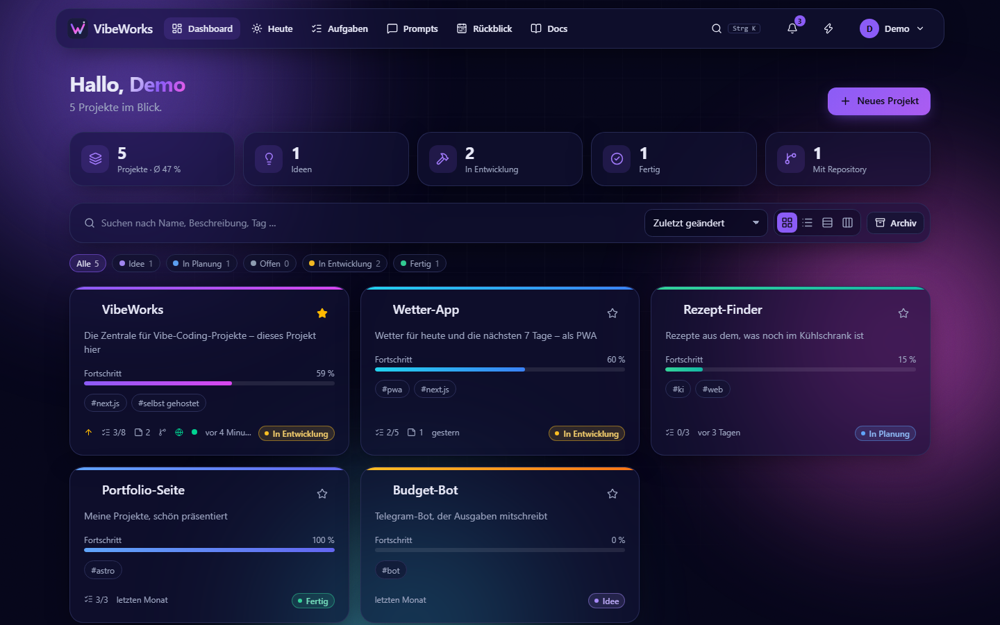
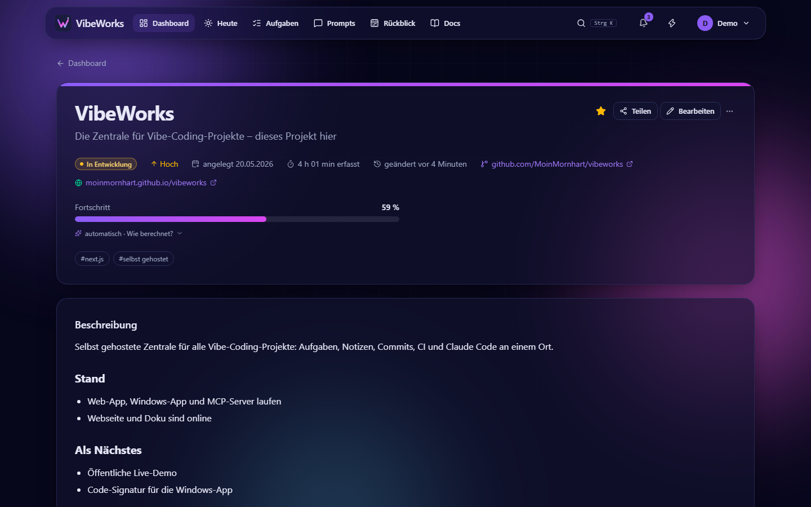
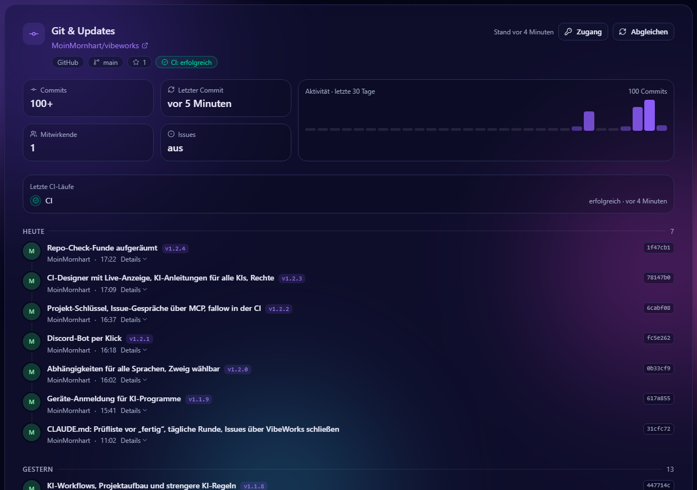
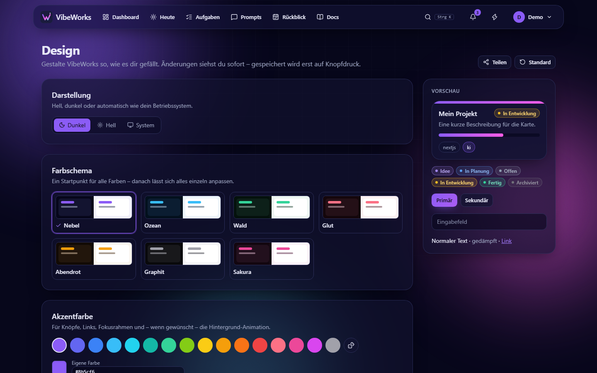
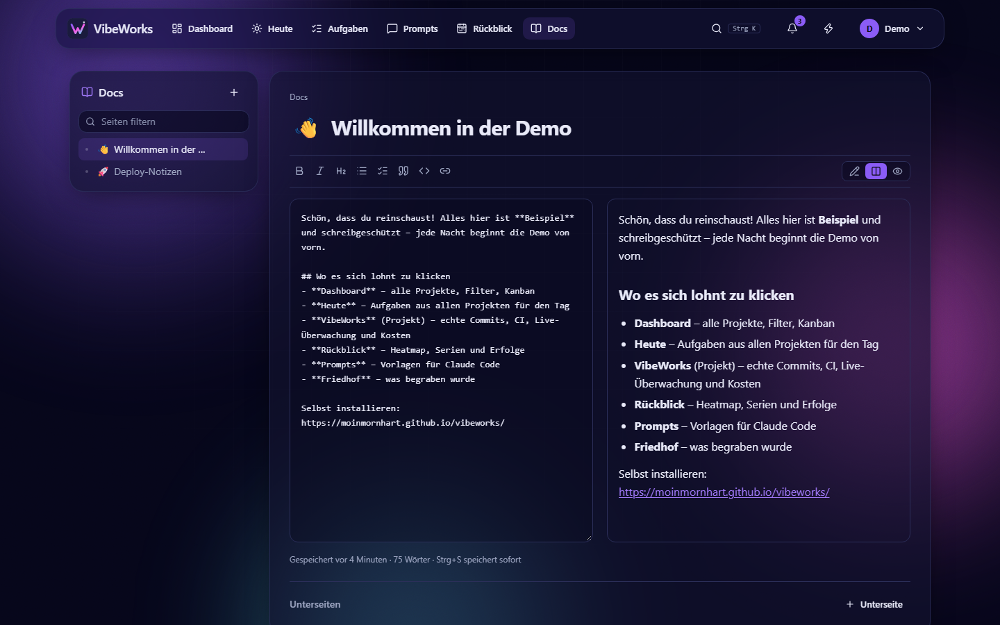
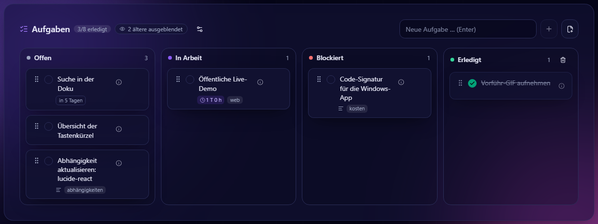
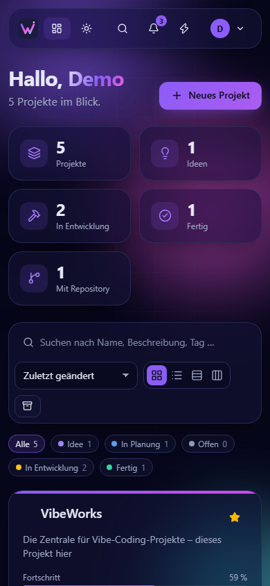
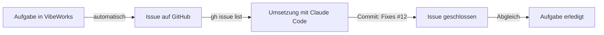

<div align="center">



<p>
  <a href="https://github.com/MoinMornhart/vibeworks/commits/main"></a>
  <a href="https://github.com/MoinMornhart/vibeworks/commits/main"></a>
  
  
  
  <a href="LICENSE"></a>
</p>

<p><b>🇩🇪 Deutsch</b> · <a href="README.en.md">🇬🇧 English</a></p>

**Projekte, Aufgaben, Notizen und Commits an einem Ort – auf deinem eigenen Server.**

[Funktionen](#-funktionen) · [Screenshots](#-screenshots) · [Installation](#-installation-auf-proxmox) · [Aufgaben ↔ Issues](#-aufgaben--issues--claude-code) · [Entwicklung](#%EF%B8%8F-entwicklung)

<br>



</div>

<br>

Beim Vibe Coding entstehen schnell viele halbfertige Projekte: hier ein Repo, dort eine Idee,
irgendwo eine Notiz. **VibeWorks** sammelt alles an einem Ort – Ideen, Status, Aufgaben,
Notizen, Dokumentation und die Commits aus deinen Repositories. Es läuft auf deinem eigenen
Proxmox-Server, aktualisiert sich selbst und sieht so aus, wie **du** willst – auf Deutsch oder
Englisch, einstellbar für jedes Konto.

## ✨ Funktionen

<table>
  <tr>
    <td width="50%" valign="top">
      <h3>🗂️ Projekte</h3>
      Raster, Liste, Status-Gruppen oder Kanban zum Ziehen. Status von <em>Idee</em> bis
      <em>Fertig</em>, Priorität, Fortschritt, Tags, Favoriten und Massenbearbeitung.
    </td>
    <td width="50%" valign="top">
      <h3>✅ Aufgaben</h3>
      Board je Projekt und Übersicht über alle Projekte – mit Fälligkeiten, Wiederholungen und
      Labels. Erledigtes und Blockiertes räumt sich nach zwei Tagen selbst weg.
    </td>
  </tr>
  <tr>
    <td valign="top">
      <h3>🔀 Git &amp; Updates</h3>
      Commits von GitHub, GitLab oder Gitea als Zeitleiste mit Aktivitätsdiagramm. Aufgaben
      werden auf Wunsch automatisch zu Issues – und zurück.
    </td>
    <td valign="top">
      <h3>📝 Notizen &amp; Docs</h3>
      Markdown-Notizen direkt am Projekt und Mini-Docs mit Seitenbaum für alles, was du immer
      wieder nachschlägst.
    </td>
  </tr>
  <tr>
    <td valign="top">
      <h3>🎨 Dein Design</h3>
      Animierte Hintergründe (Nebel, Sternenhimmel, Polarlicht, Partikel, Wellen, Synthwave …),
      eigener Farbverlauf oder eigenes Bild, Akzentfarbe, komplette Palette, Hell/Dunkel und
      Glas-Effekt – für jedes Konto einzeln.
    </td>
    <td valign="top">
      <h3>🔐 Sicher</h3>
      Passkeys, Zwei-Faktor-Anmeldung mit Wiederherstellungscodes, Sitzungsverwaltung,
      Sperre nach Fehlversuchen, CSP, CSRF- und SSRF-Schutz, verschlüsselte Tokens.
    </td>
  </tr>
  <tr>
    <td valign="top">
      <h3>⚡ Schnell</h3>
      Befehlspalette mit <kbd>Strg</kbd>+<kbd>K</kbd>, Volltextsuche über Projekte, Notizen,
      Aufgaben und Docs, Schnellerfassung per Blitz – auch auf dem Handy.
    </td>
    <td valign="top">
      <h3>🚀 Pflegeleicht</h3>
      Ein Befehl installiert alles auf Proxmox. Updates kommen alle 15 Minuten von selbst,
      mit Backup, Gesundheitsprüfung und automatischem Rollback.
    </td>
  </tr>
</table>

## 📸 Screenshots

<table>
  <tr>
    <td width="50%"><p align="center"><sub>Projektseite</sub></p></td>
    <td width="50%"><p align="center"><sub>Git &amp; Updates</sub></p></td>
  </tr>
  <tr>
    <td><p align="center"><sub>Eigenes Design</sub></p></td>
    <td><p align="center"><sub>Mini-Docs</sub></p></td>
  </tr>
</table>

<p align="center">
  
  <br><sub>Aufgabenboard – mit Token werden daraus automatisch Issues</sub>
</p>

<p align="center">
  
  <br><sub>Auch unterwegs</sub>
</p>

## 🚀 Installation auf Proxmox

Auf dem Proxmox-VE-Host ausführen:

```bash
bash -c "$(curl -fsSL https://raw.githubusercontent.com/MoinMornhart/vibeworks/main/install/proxmox.sh)"
```

Das Skript legt einen Debian-LXC-Container an, installiert Node.js, PostgreSQL und VibeWorks
und richtet das automatische Update ein. Details stehen in [docs/INSTALLATION.md](docs/INSTALLATION.md).

### Befehle

Auf dem **Proxmox-Host** (richtet der Installer ein):

```bash
vibeworks status                         # Version, Releases, Auto-Update, Dienst
vibeworks update                         # neueste Version installieren
vibeworks domain vibeworks.example.de    # Adresse ändern
vibeworks repair                         # Installation im Container reparieren
vibeworks help                           # alle Befehle
```

Auf dem Host gibt es dazu die Abkürzung **`update`** (= `vibeworks update`, auch
`update --status` usw.). Nachrüsten auf einem bestehenden Host – installiert die Befehle
und holt sofort das neueste Update (eine unvollständige Installation wird dabei repariert):

```bash
curl -fsSL https://raw.githubusercontent.com/MoinMornhart/vibeworks/main/install/vibeworks-host.sh -o /usr/local/bin/vibeworks && chmod +x /usr/local/bin/vibeworks && ln -sf /usr/local/bin/vibeworks /usr/local/bin/update && update
```

Im **Container** heißt der Befehl `update` (`update --status`, `update --rollback`,
`update --domain …`, `update --help`). Außerdem gibt es im Admin-Bereich einen Knopf
„Neuestes Update installieren“.

Der Server prüft zusätzlich **alle 15 Minuten** selbst auf neue Versionen. Jede Version wird in
einem eigenen Verzeichnis gebaut; erst wenn der Build klappt und die App danach gesund antwortet,
wird umgeschaltet – sonst bleibt bzw. springt alles automatisch auf den letzten funktionierenden
Stand zurück.

## 🔀 Aufgaben ↔ Issues & Claude Code

Trägst du am Projekt ein Repository ein, zeigt VibeWorks dessen Commits unter den Notizen.
Mit einer Git-Verbindung (**Mein Konto → Git-Verbindungen** – GitHub, GitLab oder Gitea/Forgejo,
auch selbst gehostet) wird zusätzlich jede Aufgabe automatisch zum Issue. Die Verbindung gilt
für alle deine Projekte auf diesem Server; der Server gleicht alle 5 Minuten selbst ab. Der
Status wandert in beide Richtungen mit:

| Spalte in VibeWorks | Issue im Repository |
| --- | --- |
| Offen | offen |
| In Arbeit | offen, Label `in Arbeit` |
| Blockiert | offen, Label `blockiert` |
| Erledigt | geschlossen |

Damit lassen sich Aufgaben bequem von einer KI abarbeiten – zum Beispiel mit
[Claude Code](https://claude.com/claude-code): „Arbeite die offenen Issues ab.“ Claude holt
sich die Issues mit `gh issue list`, setzt `in Arbeit`, committet mit `Fixes #12` – das Issue
schließt sich, und beim nächsten Abgleich springt die Aufgabe in VibeWorks auf *Erledigt*.



<details>
<summary><b>Welches Token brauche ich?</b></summary>

Die App zeigt beim Verbinden eine kurze Anleitung mit Link zur passenden Token-Seite:

| Anbieter | Token |
| --- | --- |
| GitHub | Klassisches Token mit dem Recht `repo` (der Link ist vorausgefüllt) |
| GitLab | Personal-Access-Token mit dem Scope `api` |
| Gitea / Forgejo | Token mit *repository: Lesen* und *issue: Lesen und Schreiben* |

Die Verbindung lässt sich schon bei der Registrierung eintragen oder später unter „Mein Konto“.
Ein eigenes Token pro Projekt geht weiterhin (Projektseite → **Git & Updates** → **Zugang**).
Für öffentliche Repositories ohne Issue-Spiegelung reicht die Adresse – dann braucht es gar kein
Token. Tokens werden beim Speichern geprüft, mit AES-256-GCM verschlüsselt gespeichert und nie
wieder vollständig angezeigt.

</details>

## 🛠️ Entwicklung

```bash
npm install
npm run setup          # .env mit zufälligem APP_SECRET anlegen
npm run db:migrate     # Schema in die PostgreSQL aus DATABASE_URL einspielen
npm run dev            # → http://localhost:3000
```

| Skript | Zweck |
| --- | --- |
| `npm run dev` | Entwicklungsserver |
| `npm run build` / `npm start` | Produktionsbuild und -start |
| `npm run typecheck` | TypeScript prüfen |
| `npm test` | Unit-Tests (Vitest) |
| `npm run version:bump` | Version um eine Stufe erhöhen |

**Stack:** Next.js 15 (App Router) · React 19 · TypeScript · Tailwind CSS 4 · Prisma ·
PostgreSQL · SimpleWebAuthn · dnd-kit · Vitest

### Versionsschema

Versionen zählen wie ein Zählwerk mit Übertrag bei 9:
`0.0.1 → 0.0.2 → … → 0.0.9 → 0.1.0 → … → 0.9.9 → 1.0.0`.
Die laufende App leitet ihre Version aus der Zahl der Commits ab; jede ausgelieferte Änderung
bekommt einen Eintrag im Änderungsverlauf (`src/lib/changelog.ts`), der in der App angezeigt wird.

## 🗺️ Fahrplan

✅ = fertig · ⏳ = kommt noch

**Etappe 1 – Grundlagen** ✅

- ✅ Anmeldung mit Passwort, Passkeys und Zwei-Faktor, Mehrbenutzerbetrieb
- ✅ Projekte, Notizen, Aufgaben und Mini-Docs
- ✅ Persönliches Design für jedes Konto
- ✅ Oberfläche auf Deutsch und Englisch
- ✅ Proxmox-Installer, `update`-Befehl und Auto-Update

**Etappe 2 – Git-Anbindung**

- ✅ Commits auf der Projektseite
- ✅ Aufgaben ↔ Issues (GitHub, GitLab, Gitea/Forgejo)
- ✅ Git-Verbindungen fürs ganze Konto, Abgleich im Hintergrund
- ✅ Projekte teilen
- ⏳ CI-Status
- ⏳ Webhooks

**Etappe 3 – Überblick & Komfort**

- ⏳ Wochenrückblick und Zeitleiste
- ⏳ Projektvorlagen
- ⏳ Import/Export
- ⏳ Benachrichtigungen (ntfy, Webhook, E-Mail)

## 📄 Lizenz

MIT – siehe [LICENSE](LICENSE).
